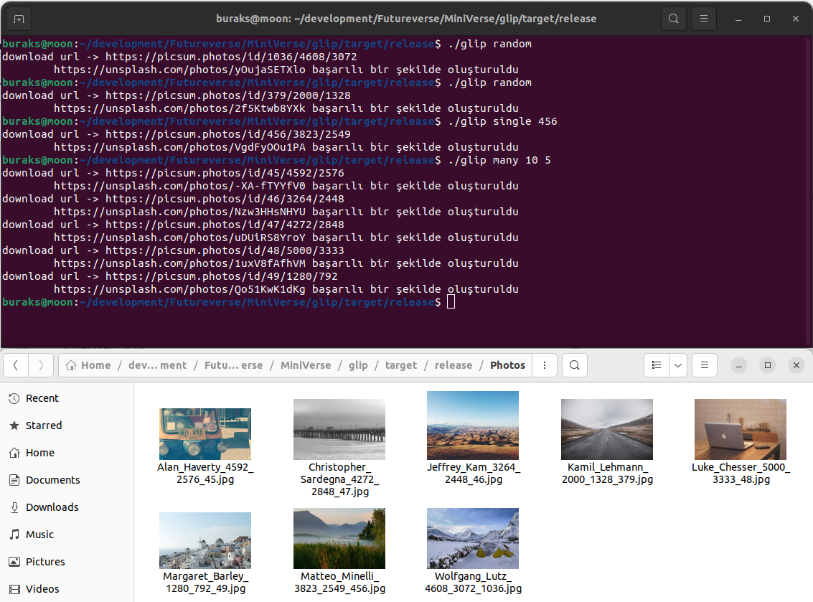

# glimp _(Get Lorem Picsum Photo)_

Popüler bir lorem ipsum türü olan [bu siteden](https://picsum.photos/) basit REST sorguları ile Unsplash kaynaklı fotoğraflar çekmek mümkün. Bir uygulamada rastgele fotoğraflara ihtiyacımız olduğu hallerde kullanımı ideal. Örnek uygulamada bu siteye basit REST sorguları gönderip fotoğrafların local bilgisayar ortamına JPG olarak indirilmesi söz konusu.

## Ortam Bilgileri

| Kriter               | Değer                           |
|----------------------|---------------------------------|
| Operating System     | Ubuntu 22.04                    |
| Programming Language | Rust                            |
|IDE| IntelliJ IDEA Community Edition |

## Örnek REST sorguları

| URL                                            | Açıklama                                                                                                                                              |
|------------------------------------------------|-------------------------------------------------------------------------------------------------------------------------------------------------------|
| https://picsum.photos/v2/list?page=2&limit=100 | Sayfalama tekniği ile 2nci sayfadan 100 fotoğraf getirir.                                                                                             |
| https://picsum.photos/id/12/info               | Belli bir ID değerine sahip fotoğrafı getirir. Örneğin 12 nolu fotoğraf gibi.                                                                         |
| https://picsum.photos/     | Tam anlamıyla rastgele bir fotoğraf getirir. Bu örnekte 640X480 boyutlarında.                                                                         |
| https://picsum.photos/640/480?grayscale        | 640X480 boyutlarında rastgele bir fotoğraf getirir ama bunu siyah beyaz formata çevirerek yapar.|

## Senaryo

Uygulama terminalden aşağıdaki şekilde çalıştırılır.

```bash
# belli bir id'ye ait fotoğrafı indirmek için
./glimp single 123

# 5nci sayfadan itibaren 10 kayıt getirmek için
./glimp many 5 10

# rastgele bir fotoğraf indirmek için
./glimp random
```

## cargo İşlemleri 

```bash
# projeyi derlemek için
cargo build

# release almak için
cargo build -r

# testler için
cargo test

# Kodlar ilgili iyileştirme önerilerini görmek için
cargo clippy
```

## Çıktılar

Uygulamaya ait örnek çalışma zamanı çıktısı aşağıdaki gibidir.

