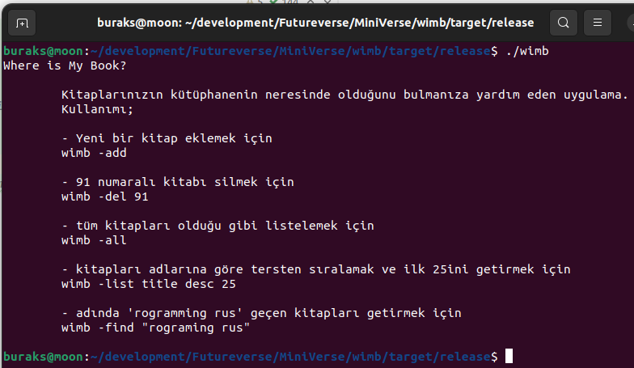
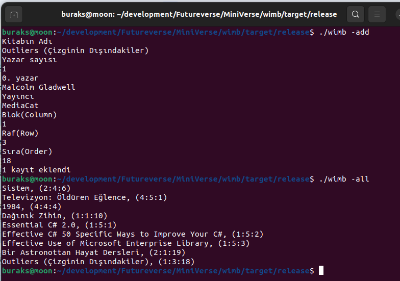
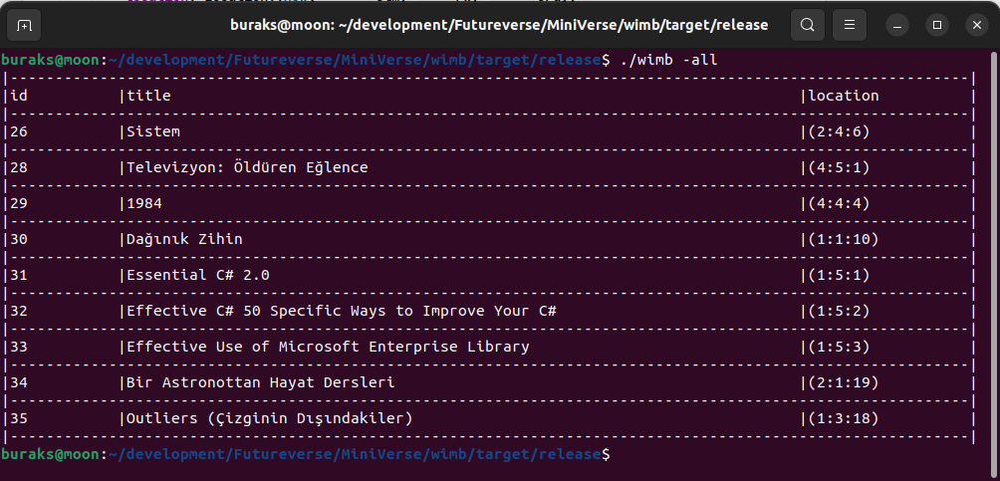
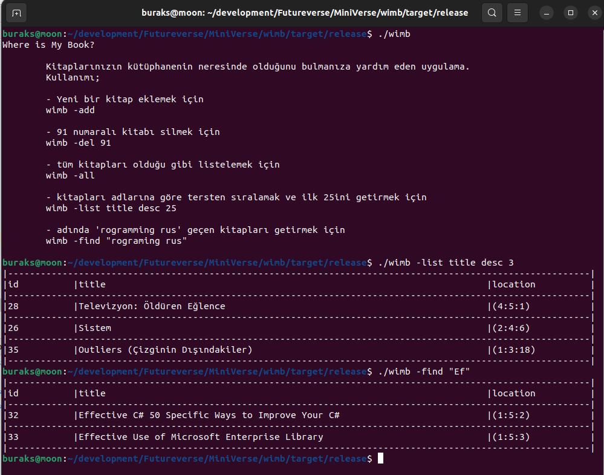

# wimb _(Where Is My Book)_

Kütüphanemde yüzden fazla kitap var ve bazen ihtiyacım olanı bulmakta zorlanıyorum. Hangi kitabın nerede olduğunu kolayca bulabileceğim bir yol arıyorum ve bunu görsellikten uzak şekilde bir terminal uygulaması üzerinden yapabilmek istiyorum.

## Ortam Bilgileri

| Kriter               | Değer                           |
|----------------------|---------------------------------|
| Operating System     | Ubuntu 22.04                    |
| Programming Language | Rust                            |
|IDE| IntelliJ IDEA Community Edition |

## Senaryo - 1

1. Temrinalde **wimb** yazılarak uygulama çalıştırılır.
2. Bir karşılama ekranı sunulur. **ASCII** sanatı uygulanabilir.
3. Ardından kulanıcıyı bir **menü** karşılar.
   1. Ekle
   2. Ara
   3. Listele
   4. Sil
4. **Ekle** seçilirse kullanıcıya şunlar sorulur.
   1. Kitabın adı
   2. Yazarı/Yazarları
   3. Yayınevi
   4. Yayın tarihi
   5. Kategorisi
   5. Sütun
   6. Raf
   7. Sıra
5. **Ara** seçilirse kitabın adı sorulur _(İçinde geçeni ara şeklinde çalışır)_
6. **Listele** seçilirse kullanıcıya sıralama kriteri sorulur ve buna göre sıralanır.
   1. Ada göre (asc/desc)
   2. Yazar adına göre (asc/desc)
   3. Yayın tarihine göre (asc/desc)
   4. Sütuna göre (Hangi sütunda hangi kitaplar var)
   5. Kategoriye göre (asc/desc)
   6. vb
7. **Sil** seçilirse kitabın id bilgisi sorulur ve silme işlemi yapılır.

## Senaryo - 2

Senaryo - 1 de yer alan menü ve adımlar komut satırından girilen argümanlarla karşılanır. Buna göre detaylı bir help dokümanı gerekir.
Örnekler;

```bash
# Yeni bir kitap eklemek için
wimb -add
# 91 numaralı kitabı silmek için
wimb -del 91
# kitapları adlarına göre tersten sıralamak ve ilk 25ini getirmek için
wimb -list name desc 25
# kitapları yayıncı adlarına göre sıralayıp ilk 10 dakini getirmek için
wimb -list publisher asc 10
# adında 'rogramming rus' geçen kitapları getirmek için
wimb -find "rograming rus"
```

## Çıktılar

Örnek çalışma zamanı çıktıları şöyle.





Listeleme görünümünün güncelleştirilmiş hali sonrası çalışma zamanı aşağıdaki gibidir.





## Kod Tabanı ile Çalışacaklar İçin

Eğer kod tabanını indirip çalışmayı planlıyorsanız belki veritabanını sıfırdan oluşturmanız gerekebilir. Örnek Sqlite veritabanını kullanmaktadır. Bu tip bir çözüm için yeterlidir. Veritabanı içeriğinin ilgili veri yapıları ile otomatik oluşturulabilmesi için diesel_cli aracından yararlanılabilir.

```bash
# diesel_cli aracını yüklemek için
cargo install diesel_cli --no-default-features --features sqlite
```

### Veritabanı oluşturma ve Migration İşleri

Aşağıdaki adımlarla devam edip ilk migration planını çalıştırabiliriz. Ancak öncesinde root klasörde .env uzantılı bir dosya açıp içerisine veritabanı bağlantı bilgisini yazmalıyız. Ben veritabanı dosyasını tutmak için Data isimli bir klasör oluşturdum ve .env dosyası içerisinde aşağıdaki içeriği kullandım.

```text
DATABASE_URL=./Data/library.db
```

Migration hazırlıkları için,

```bash
diesel setup
diesel migration generate initiate_db
```

Bu komutlar migrations klasöründe tarih bilgisinin kullanıldığı bir klasör oluşturup içerisine up ve down isimli sql dosyalarını bırakır. Buraya yazılan SQL komutları migration upgrate ve downgrade operasyonlarında kullanılır. up.sql ve down.sql dosyalarını tamamladıktan sonra aşağıdaki komut ile migration planı işletilir.

```bash
diesel migration run
```

Terminalden tabloların oluşup oluşmadığını kontrol etmek için aşağıdaki işlemleri yapabiliriz.

```bash
sqlite3 ./Data/library.db
.tables
select * from books;
.exit
```